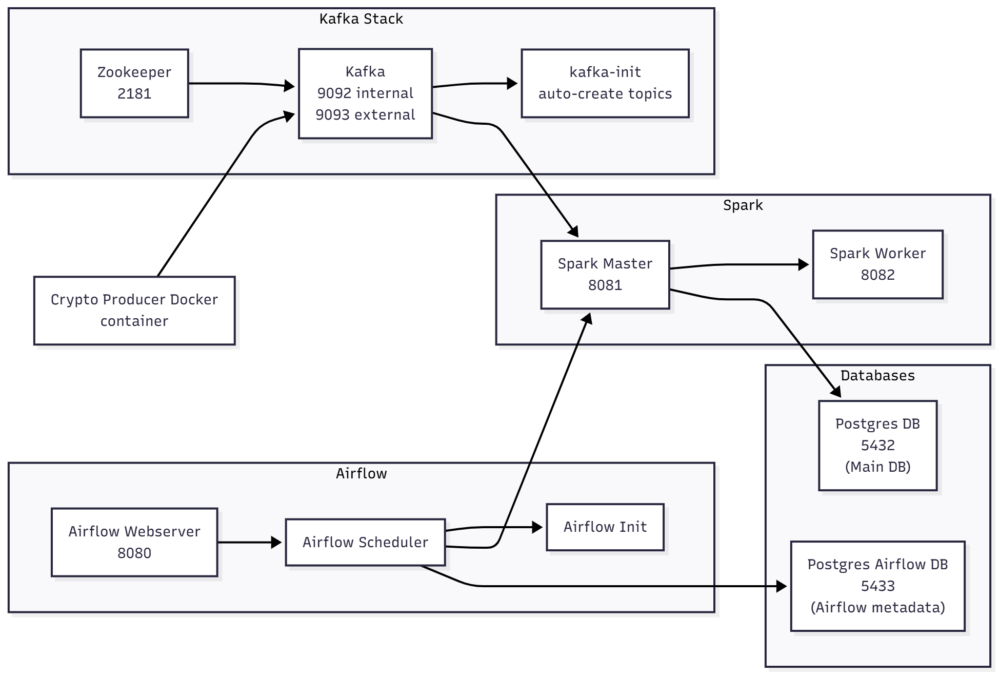
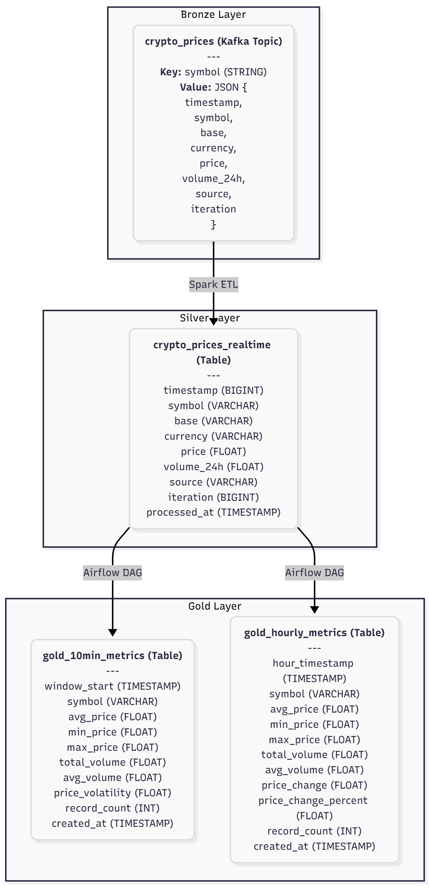

# 💰 Real-Time Cryptocurrency Analytics Pipeline

## 🆕 **SPARK vs FLINK COMPARISON PROJECT**

> **Mục tiêu mở rộng (IS405)**: So sánh hiệu suất giữa **Apache Spark Streaming** và **Apache Flink** trong xử lý dữ liệu real-time.

### 🔥 Điểm nổi bật của phần mở rộng:
- ✅ **Song song 2 engine**: Cùng xử lý 1 nguồn dữ liệu Kafka
- ✅ **So sánh thực nghiệm**: Latency, Throughput, Resource Usage
- ✅ **Dashboard riêng**: Spark UI (8081) vs Flink Dashboard (8082)
- ✅ **Tự động hóa**: Script demo PowerShell để quan sát real-time

📖 **[Xem chi tiết so sánh tại đây](docs/SPARK_VS_FLINK_COMPARISON.md)**

---

## 📋 Mục tiêu (Objective)

Project này xây dựng một **Real-Time ETL Pipeline** hoàn chỉnh theo kiến trúc **Medallion** (Bronze-Silver-Gold) để xử lý dữ liệu cryptocurrency từ Coinbase API, cung cấp analytics và insights theo thời gian thực cho 5 loại cryptocurrency: **BTC, ETH, SOL, ADA, DOGE**.

**Vấn đề giải quyết:**

- **Real-time ingestion**: Thu thập dữ liệu giá và khối lượng giao dịch từ Coinbase API mỗi 10 giây.
- **Stream processing**: Xử lý dữ liệu real-time với Spark Structured Streaming **+ Apache Flink (mở rộng)**.
- **Data aggregation**: Tạo metrics theo cửa sổ thời gian (10 phút, 1 giờ) cho phân tích.
- **Orchestration**: Tự động hóa pipeline với Apache Airflow.
- **Analytics ready**: Cung cấp dữ liệu sẵn sàng cho BI tools (Grafana, pgAdmin, REST API).

## 🏗️ Kiến trúc (Architecture)


**Kiến trúc Medallion**: Bronze (Kafka) → Silver (Raw Data) → Gold (Aggregated Metrics)

## 🛠️ Công nghệ sử dụng (Tech Stack)

| Component             | Technology                      | Version   |
|-----------------------|---------------------------------|-----------|
| **Message Broker**    | Apache Kafka                    | 7.3.0     |
| **Stream Processing** | Apache Spark Structured Streaming | 3.5.0     |
| **Stream Processing (NEW)** | **Apache Flink**           | **1.18.0** |
| **Database**          | PostgreSQL                      | 14        |
| **Orchestration**     | Apache Airflow                  | 2.8.1     |
| **Data Source**       | Coinbase API                    | v2        |
| **Producer**          | Python + kafka-python           | 3.11 / 2.0.2 |
| **Container Platform**| Docker + Docker Compose         | Latest    |
| **BI Visualization**  | Grafana (optional)              | Latest    |
| **API Framework**     | FastAPI (optional)              | Latest    |

> **🆕 Apache Flink** được thêm vào để so sánh hiệu suất với Spark Streaming

## 📊 Cấu trúc Dữ liệu (Schema)

### Infrastructure Layout:

 

### Data Schema:

 

### Tracked Cryptocurrencies:

```python
CRYPTO_PAIRS = [
    'BTC-USD',  # Bitcoin
    'ETH-USD',  # Ethereum
    'SOL-USD',  # Solana
    'ADA-USD',  # Cardano
    'DOGE-USD'  # Dogecoin
]
```

## 🚀 Cách thiết lập và chạy (Setup & Run)

### Prerequisites:

- Docker Desktop (Windows)
- Docker Compose
- Git
- PowerShell
- Minimum 8GB RAM, 20GB disk space

### Bước 1: Clone Repository

```powershell
git clone https://github.com/vngbthang/real-time-cryptocurrency-data-pipeline.git
cd real-time-cryptocurrency-data-pipeline
```

### Bước 2: Khởi động Infrastructure

```powershell
# Start all Docker containers
docker-compose up -d

# Verify all containers are running (should see 11 containers)
docker ps
```

**Lưu ý:** Database schema và Kafka topics sẽ được tạo tự động khi containers khởi động lần đầu:
- ✅ PostgreSQL tables: `crypto_prices_realtime`, `gold_hourly_metrics`, `gold_10min_metrics` (via `init-db.sql`)
- ✅ Kafka topic: `crypto_prices` (via `kafka-init` container)
- ✅ Producer: Tự động start và bắt đầu gửi dữ liệu

### Bước 3: Trigger Spark Streaming Job

```powershell
# Open Airflow UI
Start-Process "http://localhost:8080"

# Login: admin / admin
# Navigate to DAGs -> Find "crypto_streaming_pipeline"
# Click "Trigger DAG" (play icon)
```

### Bước 4: Enable Gold Layer Aggregation

Airflow UI, unpause các DAGs:
- `gold_hourly_aggregation`
- `gold_10min_aggregation`

---

## 🆕 **DEMO SO SÁNH SPARK vs FLINK**

### Quick Start với Demo Script:

```powershell
# Chạy script demo tự động
.\demo.ps1
```

Script sẽ:
1. ✅ Khởi động tất cả services (Kafka, Spark, Flink, PostgreSQL)
2. ✅ Chờ dữ liệu được xử lý
3. ✅ Hiển thị menu tương tác để so sánh:
   - Tổng quan dữ liệu
   - So sánh độ trễ (Latency)
   - So sánh thông lượng (Throughput)
   - Xem logs và dashboards

### Hoặc chạy thủ công:

```powershell
# 1. Khởi động hệ thống
docker-compose up -d

# 2. Kiểm tra Flink đang chạy
docker logs flink-crypto-processor

# 3. Truy cập Dashboards
Start-Process "http://localhost:8082"  # Flink Dashboard
Start-Process "http://localhost:8081"  # Spark UI

# 4. So sánh dữ liệu
docker exec -it postgres-db psql -U user -d crypto_data -f /sql/comparison_queries.sql
```

### 📊 Web Dashboards:
- **Spark Master UI**: http://localhost:8081
- **Flink Dashboard**: http://localhost:8082
- **Airflow UI**: http://localhost:8080 (admin/admin)

---

### Bước 5: Kiểm tra dữ liệu

```powershell
# Check Silver layer
docker exec -it postgres-db psql -U user -d crypto_data -c "SELECT symbol, price, processed_at FROM crypto_prices_realtime ORDER BY processed_at DESC LIMIT 5;"

# Check Gold Hourly Metrics
docker exec -it postgres-db psql -U user -d crypto_data -c "SELECT symbol, ROUND(avg_price::numeric, 2) as avg_price, ROUND(price_change_percent::numeric, 2) as change_pct FROM gold_hourly_metrics ORDER BY hour_timestamp DESC LIMIT 5;"

# Check Gold 10-Minute Metrics
docker exec -it postgres-db psql -U user -d crypto_data -c "SELECT symbol, ROUND(avg_price::numeric, 2) as avg, ROUND(price_volatility::numeric, 2) as volatility FROM gold_10min_metrics ORDER BY window_start DESC LIMIT 5;"
```

## 📈 Kết quả (Final Output)

### Silver Layer Table: `crypto_prices_realtime`
- **Mục đích:** Raw structured data from Spark streaming.
- **Use cases:** Real-time price monitoring, data quality checks, raw data for ad-hoc analysis.

### Gold Layer Table 1: `gold_hourly_metrics`
- **Mục đích:** Hourly aggregated analytics.
- **Use cases:** Historical trend analysis, day-over-day comparisons, hourly performance reports.

### Gold Layer Table 2: `gold_10min_metrics`
- **Mục đích:** Near real-time analytics with 10-minute windows.
- **Use cases:** Real-time volatility monitoring, short-term trading signals, anomaly detection.

## 📁 Cấu trúc Project

```
real-time-cryptocurrency-data-pipeline/
│
├── docker-compose.yml              # Infrastructure orchestration (11 containers)
├── Dockerfile.producer             # Containerized producer build file
├── requirements.txt                # Python dependencies
├── README.md                       # This file
│
├── coinbase_producer.py            # Multi-coin data producer
│
├── init-kafka.sh                   # Auto-create Kafka topics on startup
├── init-airflow.sh                 # Auto-trigger Airflow DAGs (optional)
├── init-db.sql                     # Auto-create database schema on startup
│
├── spark-apps/
│   └── spark_stream_processor.py   # Spark Structured Streaming job
│
├── dags/                           # Airflow orchestration
│   ├── auto_startup_pipeline.py    # Auto-startup orchestration
│   ├── crypto_producer.py          # Producer DAG (alternative)
│   ├── submit_spark_stream.py      # Main streaming pipeline DAG
│   ├── gold_aggregation.py         # Hourly metrics aggregation
│   └── gold_10min_aggregation.py   # 10-minute metrics aggregation
│
└── logs/                           # Airflow logs directory
```

## 🎯 Key Features

- ✅ **Real-Time Processing**: 10-second polling and 15-second micro-batching.
- ✅ **Multi-Cryptocurrency Support**: Tracks 5 major coins, easily extensible.
- ✅ **Medallion Architecture**: Bronze (Kafka), Silver (PostgreSQL), and Gold (PostgreSQL) layers.
- ✅ **Data Quality & Reliability**: Spark checkpointing, producer retry logic, and data retention policies.
- ✅ **Orchestration & Monitoring**: Fully automated with Airflow and monitored via Spark UI and Airflow UI.
- ✅ **Scalability**: Designed for horizontal and vertical scaling.
- ✅ **Analytics Ready**: Pre-aggregated metrics in the Gold layer for fast BI queries.

## 📚 Deployment Guide (Hướng dẫn Triển khai Chi tiết)

### 🔍 Monitoring & Verification (Giám sát & Kiểm tra)

#### Initialization Scripts (Scripts Khởi tạo Tự động)

Project sử dụng các script tự động để khởi tạo môi trường:

**1. `init-kafka.sh` (Kafka Initialization)**
- **Chức năng**: Tự động tạo Kafka topic `crypto_prices` khi Kafka container khởi động
- **Chi tiết**:
  - Đợi 30 giây cho Kafka sẵn sàng
  - Tạo topic với 3 partitions, replication factor = 1
  - Liệt kê tất cả topics để verify
- **Container**: `kafka-init` trong docker-compose.yml
- **Log kiểm tra**:
```powershell
docker logs kafka-init
```

**2. `init-airflow.sh` (Airflow Initialization - Optional)**
- **Chức năng**: Tự động trigger DAGs khi Airflow khởi động (nếu muốn tự động hóa)
- **Chi tiết**:
  - Đợi 60 giây cho Airflow webserver sẵn sàng
  - Unpause và trigger `crypto_streaming_pipeline`
  - Unpause `gold_hourly_aggregation` và `gold_10min_aggregation`
- **Lưu ý**: Script này chưa được tích hợp vào docker-compose (chạy thủ công nếu cần)
- **Cách chạy thủ công**:
```powershell
docker exec -it airflow-webserver bash /opt/airflow/init-airflow.sh
```

**3. `init-db.sql` (Database Schema Initialization)**
- **Chức năng**: Tự động tạo database schema khi PostgreSQL container khởi động lần đầu
- **Chi tiết**:
  - Tạo 3 bảng: `crypto_prices_realtime`, `gold_hourly_metrics`, `gold_10min_metrics`
  - Sử dụng `CREATE TABLE IF NOT EXISTS` để tránh lỗi nếu chạy lại
- **Container**: Mounted vào `postgres-db` tại `/docker-entrypoint-initdb.d/`
- **Log kiểm tra**:
```powershell
docker logs postgres-db | Select-String -Pattern "init-db"
```

#### Kafka Topics
```powershell
# Liệt kê tất cả topics
docker exec -it kafka kafka-topics --bootstrap-server localhost:9092 --list

# Kiểm tra messages trong topic crypto_prices
docker exec -it kafka kafka-console-consumer --bootstrap-server localhost:9092 --topic crypto_prices --from-beginning --max-messages 5
```

#### Spark Jobs
```powershell
# Truy cập Spark Master UI
Start-Process "http://localhost:8081"

# Xem log Spark Master
docker logs spark-master --tail 50

# Xem log Spark Worker
docker logs spark-worker --tail 50
```

#### Airflow DAGs
```powershell
# Xem danh sách DAGs
docker exec -it airflow-webserver airflow dags list

# Xem task instances
docker exec -it airflow-webserver airflow tasks list crypto_streaming_pipeline
```

#### Database Queries
```powershell
# Đếm số records theo symbol
docker exec -it postgres-db psql -U user -d crypto_data -c "SELECT symbol, COUNT(*) FROM crypto_prices_realtime GROUP BY symbol;"

# Kiểm tra giá mới nhất
docker exec -it postgres-db psql -U user -d crypto_data -c "SELECT DISTINCT ON (symbol) symbol, price, processed_at FROM crypto_prices_realtime ORDER BY symbol, processed_at DESC;"

# Phân tích volume (khi có dữ liệu)
docker exec -it postgres-db psql -U user -d crypto_data -c "SELECT symbol, AVG(volume_24h) as avg_volume FROM crypto_prices_realtime WHERE volume_24h IS NOT NULL GROUP BY symbol;"
```

### 🛠️ Troubleshooting (Xử lý sự cố)

#### Producer Issues
**Vấn đề**: Lỗi "NoBrokersAvailable"
```powershell
# Kiểm tra Kafka có chạy không
docker logs kafka | Select-String -Pattern "started"

# Test kết nối
Test-NetConnection localhost -Port 9093

# Nếu không được, restart Kafka
docker-compose restart kafka
Start-Sleep -Seconds 20
```

**Vấn đề**: API rate limiting
- Tăng `POLL_INTERVAL_SECONDS` trong `coinbase_producer.py` (mặc định: 10)

#### Spark Job Issues
**Vấn đề**: Job không xử lý dữ liệu
```powershell
# Kiểm tra log Spark
docker logs spark-master
docker logs spark-worker

# Kiểm tra kết nối Kafka từ Spark
docker exec -it spark-master nc -zv kafka 9092
```

**Vấn đề**: Checkpoint bị hỏng
```powershell
# Xóa checkpoints và restart
docker exec -it spark-master rm -rf /opt/spark/apps/checkpoints/*
```

#### Database Issues
**Vấn đề**: Connection refused
```powershell
# Kiểm tra PostgreSQL đang chạy
docker exec -it postgres-db pg_isready

# Kiểm tra logs
docker logs postgres-db
```

**Vấn đề**: Schema mismatch
```powershell
# Chạy lại migration script
docker cp sql/alter_tables_add_volume.sql postgres-db:/tmp/
docker exec -it postgres-db psql -U user -d crypto_data -f /tmp/alter_tables_add_volume.sql
```

### 📈 Next Steps (Bước tiếp theo)

#### Monitoring Producer Container
```powershell
# Xem logs của producer
docker logs crypto-producer --tail 50 -f

# Kiểm tra producer đang chạy
docker exec crypto-producer ps aux

# Restart producer nếu cần
docker-compose restart crypto-producer
```

#### Thêm Volume Data Thực tế
Hiện tại `volume_24h` đang là `None` vì Coinbase API v2 `/spot` endpoint không cung cấp volume. Để thêm volume thực:

**Option 1: Sử dụng Coinbase Advanced Trade API**
```python
# Cần xác thực
COINBASE_PRODUCT_API = 'https://api.coinbase.com/api/v3/brokerage/products/{pair}/ticker'
# Trả về: price, volume_24h, price_percent_change_24h
```

**Option 2: Sử dụng CoinGecko API (không cần xác thực)**
```python
COINGECKO_API = 'https://api.coingecko.com/api/v3/simple/price'
# Parameters: ids=bitcoin,ethereum&vs_currencies=usd&include_24hr_vol=true
```

Cập nhật `coinbase_producer.py` để lấy volume data từ CoinGecko hoặc Advanced Trade API.

---

## 🔌 BI Integration Guide (Hướng dẫn Tích hợp BI)

### 📊 Kết nối Database

#### Thông tin kết nối PostgreSQL
```
Host: localhost
Port: 5432
Database: crypto_data
Username: user
Password: password
```

### Power BI / Tableau

#### Bước 1: Chọn Data Source
- Mở Power BI Desktop hoặc Tableau
- Chọn "PostgreSQL" làm data source
- Nhập thông tin kết nối ở trên

#### Bước 2: Select Tables
Chọn các bảng:
- `crypto_prices_realtime` (Silver Layer) - Real-time data
- `gold_hourly_metrics` (Gold Layer) - Hourly analytics
- `gold_10min_metrics` (Gold Layer) - 10-minute analytics

#### Bước 3: Tạo Visualizations

**Dashboard 1: Real-Time Price Monitor**
```sql
SELECT 
    symbol,
    price,
    processed_at,
    LAG(price) OVER (PARTITION BY symbol ORDER BY processed_at) as prev_price,
    ROUND(((price - LAG(price) OVER (PARTITION BY symbol ORDER BY processed_at)) / 
           LAG(price) OVER (PARTITION BY symbol ORDER BY processed_at) * 100)::numeric, 2) as pct_change
FROM crypto_prices_realtime
WHERE processed_at >= NOW() - INTERVAL '1 hour'
ORDER BY processed_at DESC;
```

**Dashboard 2: Hourly Trend Analysis**
```sql
SELECT 
    hour_timestamp,
    symbol,
    avg_price,
    min_price,
    max_price,
    price_change_percent,
    total_volume
FROM gold_hourly_metrics
WHERE hour_timestamp >= NOW() - INTERVAL '24 hours'
ORDER BY hour_timestamp DESC;
```

**Dashboard 3: Volatility Monitor**
```sql
SELECT 
    window_start,
    symbol,
    avg_price,
    price_volatility,
    (max_price - min_price) as price_range,
    ROUND(((max_price - min_price) / avg_price * 100)::numeric, 2) as volatility_pct
FROM gold_10min_metrics
WHERE window_start >= NOW() - INTERVAL '2 hours'
ORDER BY window_start DESC;
```

### pgAdmin (Database Management)

#### Setup pgAdmin
```powershell
# Pull pgAdmin image
docker pull dpage/pgadmin4

# Run pgAdmin container
docker run -d `
  --name pgadmin `
  --network crypto-pipeline-net `
  -p 5050:80 `
  -e PGADMIN_DEFAULT_EMAIL=admin@admin.com `
  -e PGADMIN_DEFAULT_PASSWORD=admin `
  dpage/pgadmin4
```

#### Truy cập pgAdmin
1. Mở browser: http://localhost:5050
2. Login: `admin@admin.com` / `admin`
3. Add New Server:
   - Name: `Crypto Pipeline`
   - Host: `postgres-db`
   - Port: `5432`
   - Username: `user`
   - Password: `password`

### Grafana (Optional)

#### Setup Grafana
```powershell
# Pull Grafana image
docker pull grafana/grafana

# Run Grafana container
docker run -d `
  --name grafana `
  --network crypto-pipeline-net `
  -p 3000:3000 `
  grafana/grafana
```

#### Configure Grafana
1. Truy cập: http://localhost:3000
2. Login: `admin` / `admin`
3. Add PostgreSQL Data Source:
   - Host: `postgres-db:5432`
   - Database: `crypto_data`
   - User: `user`
   - Password: `password`
   - SSL Mode: `disable`

#### Sample Grafana Queries

**Panel 1: Current Prices**
```sql
SELECT 
  processed_at as time,
  symbol as metric,
  price as value
FROM crypto_prices_realtime
WHERE $__timeFilter(processed_at)
ORDER BY processed_at;
```

**Panel 2: Hourly Average Prices**
```sql
SELECT 
  hour_timestamp as time,
  symbol as metric,
  avg_price as value
FROM gold_hourly_metrics
WHERE $__timeFilter(hour_timestamp)
ORDER BY hour_timestamp;
```

**Panel 3: Price Volatility**
```sql
SELECT 
  window_start as time,
  symbol as metric,
  price_volatility as value
FROM gold_10min_metrics
WHERE $__timeFilter(window_start)
ORDER BY window_start;
```

### REST API (FastAPI - Optional)

Tạo file `api/main.py`:
```python
from fastapi import FastAPI
import psycopg2
from psycopg2.extras import RealDictCursor

app = FastAPI()

DB_CONFIG = {
    "host": "localhost",
    "port": 5432,
    "database": "crypto_data",
    "user": "user",
    "password": "password"
}

@app.get("/api/prices/latest")
def get_latest_prices():
    conn = psycopg2.connect(**DB_CONFIG, cursor_factory=RealDictCursor)
    cur = conn.cursor()
    cur.execute("""
        SELECT DISTINCT ON (symbol) 
            symbol, price, processed_at
        FROM crypto_prices_realtime
        ORDER BY symbol, processed_at DESC;
    """)
    results = cur.fetchall()
    cur.close()
    conn.close()
    return results

@app.get("/api/metrics/hourly/{symbol}")
def get_hourly_metrics(symbol: str, hours: int = 24):
    conn = psycopg2.connect(**DB_CONFIG, cursor_factory=RealDictCursor)
    cur = conn.cursor()
    cur.execute("""
        SELECT * FROM gold_hourly_metrics
        WHERE symbol = %s 
        AND hour_timestamp >= NOW() - INTERVAL '%s hours'
        ORDER BY hour_timestamp DESC;
    """, (symbol, hours))
    results = cur.fetchall()
    cur.close()
    conn.close()
    return results
```

Chạy API:
```powershell
pip install fastapi uvicorn psycopg2-binary
uvicorn api.main:app --reload --port 8000
```

Truy cập API docs: http://localhost:8000/docs